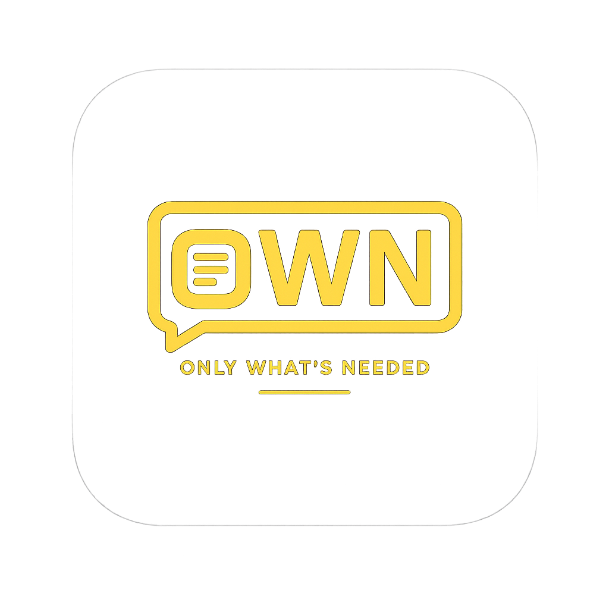

<p align="center">
  
</p>

<h1 align="center">OWN — Only What's Needed</h1>

<p align="center">
  <b>AI-powered offline video captioning for Indic & multilingual content</b>
</p>

<p align="center">
  
  
  
  
</p>

---

**OWN** is a fully offline, desktop-first application that auto-captions videos using state-of-the-art AI speech recognition. Upload a video, transcribe it in **15+ languages** (with first-class Indic language support), style your subtitles with a rich visual editor, and export broadcast-ready video — all without sending a single byte to the cloud.

## ✨ Key Features

### 🎙️ AI Transcription
- **Whisper Large v3 / v3 Turbo** — powered by [faster-whisper](https://github.com/SYSTRAN/faster-whisper) (CTranslate2) for fast CPU inference
- **Chunked processing** — splits audio at silence boundaries (~30 s chunks) for RAM-efficient transcription of long videos
- **Word-level timestamps** — every word gets precise start/end times for pixel-accurate subtitle rendering
- **Auto language detection** or explicit language selection

### 🌏 15+ Languages
Hindi · English · Bengali · Tamil · Telugu · Marathi · Gujarati · Kannada · Malayalam · Punjabi · Odia · Assamese · Urdu · Nepali · Sanskrit · Sindhi — plus Whisper's auto-detect mode

### 🔤 Indic Transliteration
- Convert native-script subtitles (देवनागरी, বাংলা, தமிழ், …) to Roman / ITRANS for karaoke-style readability
- Dual engine: rule-based (`indic-transliteration`) or LLM-powered (Gemma 4 GGUF via `llama-cpp-python`) for higher accuracy

### 🎨 Rich Subtitle Editor
| Feature             | Details                                                                              |
| ------------------- | ------------------------------------------------------------------------------------ |
| **Typography**      | 100+ fonts (bundled), size, weight, style, letter/word spacing, line height          |
| **Fills**           | Solid color, linear/radial gradients, per-word backgrounds                           |
| **Stroke & Shadow** | Independent outline and drop-shadow with full control                                |
| **Animations**      | Fade, Slide Up/Down, Pop/Scale, Typewriter, Karaoke — at both line and word level    |
| **Positioning**     | Drag-and-drop or precise X/Y (0–1 normalised) placement, configurable text-box width |
| **Markers**         | Standard / Highlight / Spotlight word styles with global or per-word overrides       |
| **Presets**         | Save and load custom style presets                                                   |

### 🎬 Video Export
- **Frame-by-frame rendering** via headless Playwright Chromium — subtitles are burned into every frame with full CSS fidelity
- Output formats: **MP4 (H.264)**, **WebM (VP9)**, and more
- Trim / cut segments before export with the visual timeline editor
- **SRT export** for traditional subtitle file delivery

### 🖥️ Desktop Integration (Windows)
- **System tray** app with one-click launch
- **CustomTkinter** native desktop window
- First-run setup wizard (hosts file, Playwright browser, model check)
- Bundled as a standalone `.exe` via Nuitka — no Python installation required for end users

---

## 📸 Architecture

```
┌──────────────────────────────────────────────────────┐
│                  main.py (Entry Point)               │
│          Starts FastAPI server + Desktop UI           │
└───────────────┬──────────────────┬───────────────────┘
                │                  │
    ┌───────────▼──────┐  ┌───────▼────────┐
    │   server/app.py  │  │   desktop/     │
    │  FastAPI REST +  │  │  tray_app.py   │
    │  WebSocket API   │  │  main_window   │
    │  Static files    │  │  setup.py      │
    └──────┬───────────┘  └────────────────┘
           │
  ┌────────┼─────────────────────────┐
  │        │                         │
  ▼        ▼                         ▼
core/              models/           web/
├─ whisper_chunked ├─ subtitle.py    ├─ index.html
├─ silence_detector├─ styles.py      ├─ editor.html
├─ exporter.py     ├─ animations.py  ├─ export_render.html
├─ transliterator                    ├─ css/app.css
├─ llm_transliterate                 └─ js/
├─ srt_utils                            ├─ api.js
├─ timeline_utils                       ├─ app.js
└─ video_utils                          ├─ editor.js
                                        ├─ preview.js
                                        └─ timeline.js
```

---

## 🚀 Getting Started

### Prerequisites

| Requirement          | Notes                                                                       |
| -------------------- | --------------------------------------------------------------------------- |
| **Python 3.12+**     | Tested on CPython 3.12 / 3.13                                               |
| **FFmpeg & FFprobe** | Place in `bin/` or ensure they're on your `PATH`                            |
| **Git**              | For cloning the repository                                                  |
| **Windows 10/11**    | Desktop integration is Windows-only; the server/web UI works cross-platform |

### Installation

```bash
# 1. Clone the repository
git clone https://github.com/damameet14/OWN--Only-Whats-Needed.git
cd OWN--Only-Whats-Needed

# 2. Create and activate a virtual environment
python -m venv venv
venv\Scripts\Activate.ps1        # PowerShell
# or: venv\Scripts\activate.bat  # CMD

# 3. Install dependencies
pip install -r requirements.txt

# 4. Install Playwright Chromium (needed for video export)
python -m playwright install chromium

# 5. Place FFmpeg binaries
#    Download from https://ffmpeg.org/download.html
#    Copy ffmpeg.exe and ffprobe.exe into the bin/ directory
```

### Running the App

```bash
# Full app (API server + browser + system tray + desktop window)
python main.py

# API-only development mode (with hot reload)
uvicorn server.app:app --host 0.0.0.0 --port 5888 --reload
```

The web UI will open automatically at **http://localhost:5888**.

---

## 🧠 AI Models

OWN uses downloadable AI models that are stored locally in `models_data/`. Models can be installed in two ways:

### In-App Download (Recommended)
Navigate to the **Settings → Models** section in the web UI. Available models:

| Model                            | Engine  | Size    | Description                                        |
| -------------------------------- | ------- | ------- | -------------------------------------------------- |
| `faster-whisper-large-v3-turbo`  | Whisper | ~800 MB | ⭐ **Default** — fast, multilingual, great accuracy |
| `faster-whisper-large-v3`        | Whisper | ~3 GB   | Best accuracy, slower on CPU                       |
| `gemma-4-E2B-it-UD-IQ3_XXS.gguf` | LLaMA   | ~1.5 GB | Transliteration model (Gemma 4 via unsloth)        |

### Manual Sideloading (ZIP)
1. Download the model ZIP from the provided Google Drive links
2. Use the **Upload ZIP** option in the Models tab
3. The app extracts, validates, and registers the model automatically

---

## 🔌 API Reference

OWN exposes a RESTful API on port `5888`. Key endpoints:

### Projects
| Method   | Endpoint             | Description                                 |
| -------- | -------------------- | ------------------------------------------- |
| `GET`    | `/api/projects`      | List all projects                           |
| `POST`   | `/api/projects`      | Upload video & create project               |
| `GET`    | `/api/projects/{id}` | Get project details                         |
| `PUT`    | `/api/projects/{id}` | Update project (subtitles, title, language) |
| `DELETE` | `/api/projects/{id}` | Delete project and associated files         |

### Transcription & Export
| Method | Endpoint                        | Description                                     |
| ------ | ------------------------------- | ----------------------------------------------- |
| `POST` | `/api/projects/{id}/transcribe` | Start Whisper transcription (returns `task_id`) |
| `POST` | `/api/projects/{id}/export`     | Start video export (returns `task_id`)          |
| `GET`  | `/api/projects/{id}/srt`        | Download SRT subtitle file                      |

### Models
| Method   | Endpoint                | Description                                     |
| -------- | ----------------------- | ----------------------------------------------- |
| `GET`    | `/api/models`           | List installed models                           |
| `GET`    | `/api/models/available` | List all available models (with install status) |
| `POST`   | `/api/models/download`  | Start model download from HuggingFace           |
| `POST`   | `/api/models/upload`    | Upload a model via ZIP file                     |
| `DELETE` | `/api/models/{id}`      | Delete an installed model                       |

### Task Progress
| Method | Endpoint                      | Description                                 |
| ------ | ----------------------------- | ------------------------------------------- |
| `GET`  | `/api/tasks/{task_id}`        | Poll task status (percent, message, result) |
| `GET`  | `/api/tasks/active`           | Get all currently running tasks             |
| `POST` | `/api/tasks/{task_id}/cancel` | Cancel a running task                       |
| `WS`   | `/ws/progress/{task_id}`      | WebSocket for real-time progress updates    |

### Other
| Method     | Endpoint             | Description                        |
| ---------- | -------------------- | ---------------------------------- |
| `POST`     | `/api/transliterate` | Transliterate Indic words to Roman |
| `GET/POST` | `/api/presets`       | Manage subtitle style presets      |
| `GET/PUT`  | `/api/user`          | User profile management            |

---

## 🏗️ Building for Distribution

OWN bundles into a standalone Windows executable using **Nuitka**:

```bash
# Install Nuitka
pip install nuitka

# Run the build script
python build.py
```

The build script:
1. Compiles `main.py` into `main.dist/` with all dependencies
2. Copies FFmpeg/FFprobe binaries (Nuitka skips `.exe` files from data dirs)
3. Bundles Playwright Chromium from the local cache
4. Runs post-build verification checks
5. Creates empty runtime directories (`data/`, `models_data/`)

### Creating an Installer

An **Inno Setup** script is included for creating a professional Windows installer:

```bash
# Requires Inno Setup 6+ installed
# Compile own_installer.iss to produce OWN_Setup_v1.0.exe
iscc own_installer.iss
```

---

## 🧪 Testing

```bash
# Run all tests
pytest -q

# Run a specific test module
pytest tests/test_silence_detector.py -q
pytest tests/test_whisper_chunked.py -q
pytest tests/test_transliterator.py -q
```

Tests cover:
- Silence boundary detection and chunk splitting
- Whisper chunked transcription pipeline
- Indic transliteration (script detection, word conversion, edge cases)

---

## 📂 Project Structure

```
OWN/
├── main.py                 # Entry point: starts server + desktop UI
├── build.py                # Nuitka build script
├── own_installer.iss       # Inno Setup installer script
├── requirements.txt        # Python dependencies
│
├── server/                 # Backend
│   ├── app.py              # FastAPI routes, WebSocket, task management
│   ├── config.py           # Paths, constants, FFmpeg resolution
│   ├── database.py         # SQLite database (projects, models, users)
│   └── model_manager.py    # Model download/install/delete logic
│
├── core/                   # Processing logic
│   ├── whisper_chunked.py  # Chunked Whisper transcription with progress
│   ├── whisper_transcriber.py  # Simple Whisper wrapper
│   ├── silence_detector.py # FFmpeg-based silence boundary detection
│   ├── exporter.py         # Frame-by-frame video export via Playwright
│   ├── transliterator.py   # Rule-based Indic → Roman transliteration
│   ├── llm_transliterate.py# LLM-powered transliteration (Gemma GGUF)
│   ├── srt_utils.py        # SRT file generation
│   ├── timeline_utils.py   # Timeline sprite/waveform generation
│   └── video_utils.py      # Video probing, format definitions
│
├── models/                 # Data models
│   ├── subtitle.py         # SubtitleTrack, SubtitleSegment, StyledWord, etc.
│   ├── styles.py           # SubtitleStyle defaults and presets
│   └── animations.py       # Animation types and state computation
│
├── desktop/                # Desktop integration (Windows)
│   ├── main_window.py      # CustomTkinter main window
│   ├── tray_app.py         # System tray icon (pystray)
│   └── setup.py            # First-run setup wizard
│
├── web/                    # Frontend (served by FastAPI)
│   ├── index.html          # Home / project dashboard
│   ├── editor.html         # Full subtitle editor
│   ├── export_render.html  # Headless rendering template
│   ├── css/app.css         # Application styles
│   └── js/
│       ├── api.js          # API client
│       ├── app.js          # Dashboard logic
│       ├── editor.js       # Subtitle editor (137 KB!)
│       ├── preview.js      # Real-time video preview with subtitles
│       └── timeline.js     # Timeline scrubber and waveform
│
├── fonts/                  # Bundled fonts (TTF/OTF/WOFF2)
├── bin/                    # FFmpeg & FFprobe executables
├── resources/              # Presets, static resources
├── data/                   # Runtime data (uploads, thumbnails, exports)
├── models_data/            # Downloaded AI models
└── tests/                  # pytest test suite
```

---

## ⚙️ Configuration

Key settings are defined in [`server/config.py`](server/config.py):

| Setting                        | Default                                                                                         | Description                         |
| ------------------------------ | ----------------------------------------------------------------------------------------------- | ----------------------------------- |
| `SERVER_PORT`                  | `5888`                                                                                          | API server port                     |
| `MAX_UPLOAD_SIZE`              | 500 MB                                                                                          | Maximum video upload size           |
| `WHISPER_MAX_CHUNK_DURATION`   | 30 s                                                                                            | Max audio chunk for transcription   |
| `WHISPER_MIN_SILENCE_DURATION` | 0.5 s                                                                                           | Min silence gap for chunk splitting |
| `WHISPER_SILENCE_THRESHOLD`    | -40 dB                                                                                          | Silence detection threshold         |
| `INPUT_EXTENSIONS`             | `.mp4`, `.mkv`, `.avi`, `.mov`, `.webm`, `.flv`, `.wmv`, `.m4v`, `.3gp`, `.ts`, `.mpg`, `.mpeg` | Accepted video formats              |

---

## 🛠️ Tech Stack

| Layer                | Technology                                           |
| -------------------- | ---------------------------------------------------- |
| **Backend**          | FastAPI, Uvicorn, SQLite                             |
| **Transcription**    | faster-whisper (CTranslate2), Vosk                   |
| **Transliteration**  | indic-transliteration, llama-cpp-python (Gemma GGUF) |
| **Video Processing** | FFmpeg, Pillow, NumPy                                |
| **Export Rendering** | Playwright (headless Chromium)                       |
| **Frontend**         | HTML/JS/CSS, TailwindCSS CDN                         |
| **Desktop**          | CustomTkinter, pystray, win10toast                   |
| **Bundling**         | Nuitka (standalone), Inno Setup (installer)          |

---

## 🤝 Contributing

1. Fork the repository
2. Create a feature branch (`git checkout -b feature/amazing-feature`)
3. Commit your changes (`git commit -m 'feat: add amazing feature'`)
4. Push to the branch (`git push origin feature/amazing-feature`)
5. Open a Pull Request

### Guidelines
- Target **Python 3.12+** style with type hints
- Use `snake_case` for functions/variables, `PascalCase` for classes
- Keep route handlers thin — place reusable logic in `core/` or `server/`
- Include tests for new features (`pytest`)
- Use short, imperative commit subjects (≤72 chars)

---

## 📄 License

This project is open source. See the [LICENSE](LICENSE) file for details.

---

<p align="center">
  <b>Made with ❤️ for the Indic content creator community</b>
  <br/>
  <sub>OWN — Because your words deserve to be seen.</sub>
</p>
